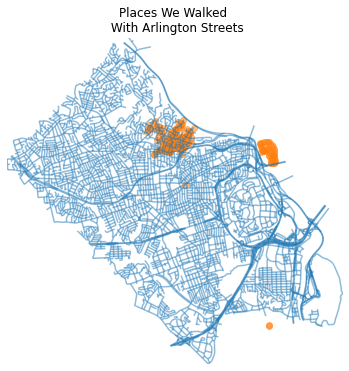

# My work

Because my professional work and schoolwork are often sensitive and not to be shared, I have included here some past passion projects.

## Walk it like I talk it

In the early phase of the pandemic, before I decided to use my extra time to pursue an MSBA, my wife and I walked several miles per day. Thankfully(?), Google captures this information from my cell phone location history. Google uses speed and position data to infer a type of activity, vehicle used, and start/stop times. I will humbly brag that it often thinks my road bike rides are executed via moped (so fast). 

Nonetheless, Google was carefully storing my walks from the early pandemic in JSON files that I could access via the Takeout feature in my Google Account. Instead of waiting for the cleaned monthly activity dashboards served up for me via email, I decided to get into the weeds and make my own map of our early pandemic walking routes in Arlington, VA. Following a Kaggle course on geospatial data, I got started on my own map. The preliminary data cleaning process is [here](Test.ipynb), if you want the code. And if you're interested in just looking at the html rendering of the map, that can be found [here](Test.html). The code was developed in the Google Colab cloud development environment.

The results are an Exploratory Data Analysis (EDA), but could serve as a basis for further analysis - or perhaps even a predictive algorithm that could identify our most-likely route for our next walk!

Take me back [home!](https:/anderson-ian.github.io/)
